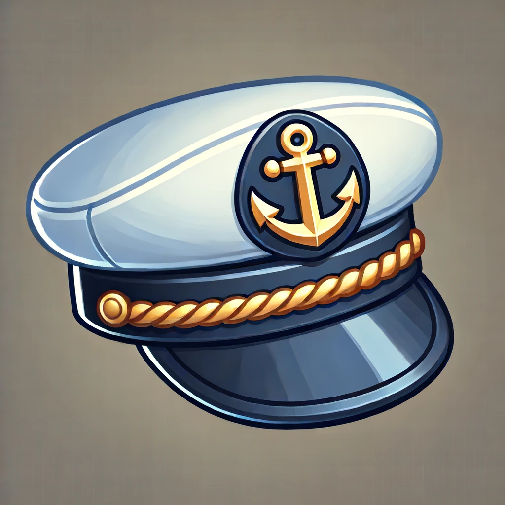

# Gopher Platform Game



Welcome to the Gopher Platform Game! This is a work-in-progress (WIP) 2D platform game built with Go, showcasing the fun and creativity of game development with WebAssembly.

## Table of Contents
- [Overview](#overview)
- [Getting Started](#getting-started)
- [Build and Run](#build-and-run)
- [Project Structure](#project-structure)
- [Contributing](#contributing)
- [License](#license)

## Overview
Gopher Platform Game is a simple yet fun 2D platform game featuring our beloved Gopher. The game is designed to explore the potential of WebAssembly in game development using Go.

## Getting Started

### Prerequisites
- Go 1.17+ installed on your machine.
- A modern web browser.

### Installation
Clone the repository:
```bash
git clone https://github.com/yourusername/gopher-platform-game.git
cd gopher-platform-game
```

## Build and Run

### Building the Game
To build the game, we use a Makefile. The Makefile handles compiling the Go code and setting up the WebAssembly environment.

```bash
make
```

This command will:
- Clean the project.
- Format the Go code.
- Download dependencies.
- Build the native Go project.
- Build the WebAssembly target.
- Copy the necessary assets to the output directory.

### Running the Game
Once built, you can run the game by serving the `dist` directory using a simple HTTP server. 

```bash
go run cmd/main.go
```

Now, open your browser and navigate to `http://localhost:8000` to play the game!

## Project Structure

```plaintext
.
├── assets
│   ├── audio
│   ├── config
│   ├── fonts
│   ├── game
│   ├── images
│   ├── index.html
│   ├── levels
│   ├── main.wasm
│   └── wasm_exec.js
├── cmd
│   ├── constructor.go
│   ├── main.go
│   ├── pprfo.go
│   └── wasm.go
├── external
├── internal
├── pkg
├── go.mod
├── go.sum
├── Makefile
└── README.md
```

- **assets**: Contains game assets like images, audio, and configuration files.
- **cmd**: Main entry points for the application.
- **external**: External dependencies or integrations.
- **internal**: Internal package implementations.
- **pkg**: Reusable Go packages for game components.
- **Makefile**: Build automation file.
- **go.mod / go.sum**: Go modules files for dependency management.
- **README.md**: This file.

## Contributing
We welcome contributions! If you'd like to help, please fork the repository, create a new branch, and submit a pull request. Make sure to follow the project's coding standards and add appropriate tests.

---

Enjoy coding and playing! Let's make Gopher jump and run through exciting levels together! 🎮
